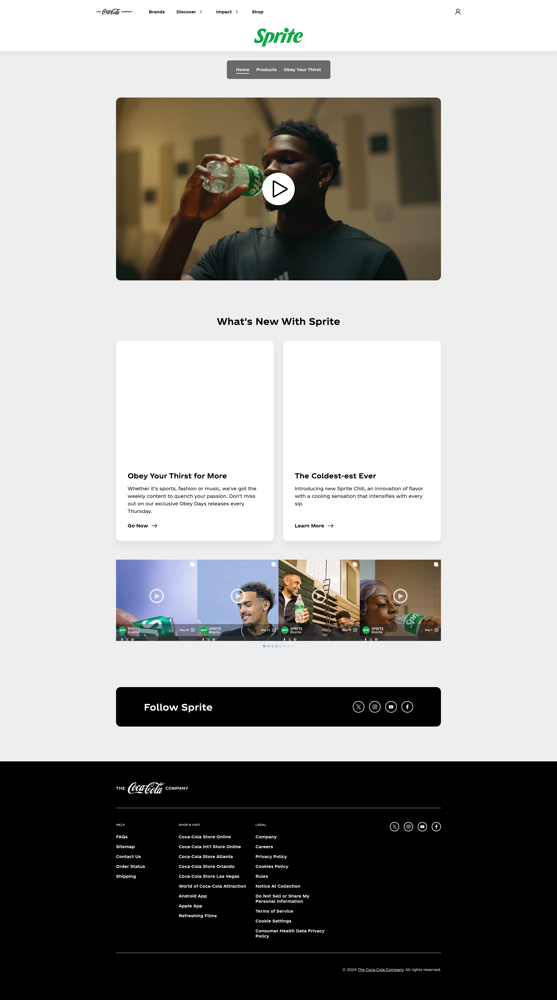

# sprite-redesign
The goal of this project is to code the official [Sprite](https://www.coca-cola.com/us/en/brands/sprite) website from scratch with some minor tweaks.

**Link to Project:** https://maximilianovalle.github.io/sprite-redesign/

**Original Website:**

**My Website:** //TODO: ADD MY WEBSITE IMAGE

## How It's Made

**Tech Used:** HTML, CSS

I used the original Sprite website seen below to code my own version of it. I worked on this project from top to bottom, focusing on placing and styling each section as closely to the original as possible before moving onto the next section.

## Lessons Learned:

I learned a lot of things from working on this project, the main one being how to look up the features I want to execute or any problems I run into. As I coded this website, I came across so many things I had no idea how to do - the gradient background, changing the profile icon image when hovered over, adding an icon image to the head - but knowing how to look these things up made doing them possible. I also learned very quickly that Stack Overflow is going to be a big part of my career. Almost every single issue I came across is something someone else has run into way before me.

I had a lot of fun working on this website! I still have so much left to learn and there are so many things I wanted to do that I just could not figure out (making the gradient background responsive to the mouse, adding the rotating drop down arrows to the header links, changing the Youtube video play button, etc.) but I know in time these are things I'll be able to come back and do.